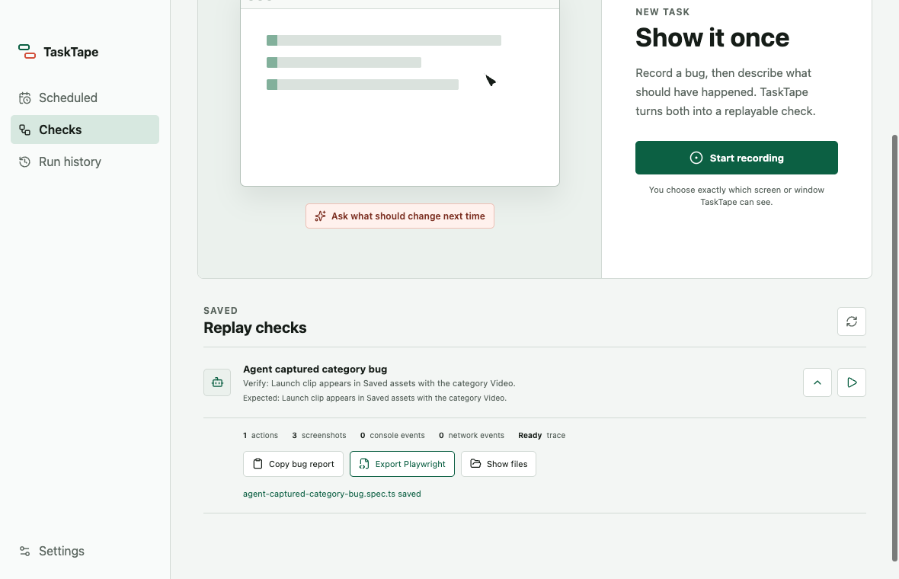
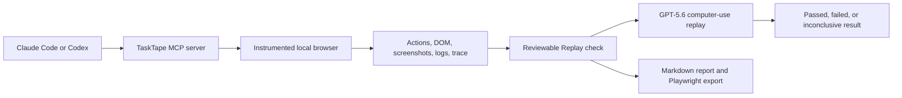

# TaskTape Replay

> Turn an agent-reproduced bug into a replayable regression check with local evidence.

[](https://github.com/codeswithroh/tasktape/actions/workflows/ci.yml)
[](https://github.com/codeswithroh/tasktape/releases/latest)
[](LICENSE)
[](https://tasktape-replay.vercel.app/)

TaskTape Replay is a macOS desktop app that lets Claude Code or Codex reproduce a local browser bug through MCP, capture the evidence, and turn that session into a check you can run again.

It records actions, screenshots, DOM snapshots, console logs, network failures, and Playwright traces. GPT-5.6 can replay the workflow on the real interface, evaluate the final screen, and save a clear passed, failed, or inconclusive result.



## Contents

- [Why TaskTape](#why-tasktape)
- [What It Does](#what-it-does)
- [Download](#download)
- [Quick Start](#quick-start)
- [Agent Connection](#agent-connection)
- [Architecture](#architecture)
- [Verification](#verification)
- [Limitations](#limitations)
- [Development](#development)

## Why TaskTape

Bug reports often arrive as screen recordings. That still leaves an engineer to reproduce the issue, inspect logs, write a regression test, and remember to run it later.

TaskTape keeps the useful part of that debugging session. An agent can reproduce the bug once, TaskTape stores the evidence, and the result becomes a reusable check with history, scheduling, and exportable Playwright code.

## What It Does

| Capability             | What happens                                                                          |
| ---------------------- | ------------------------------------------------------------------------------------- |
| Agent-operated capture | Claude Code or Codex controls a local browser through TaskTape's MCP server.          |
| Evidence bundle        | TaskTape stores actions, screenshots, DOM, console, network, and trace files locally. |
| GPT-5.6 replay         | OpenAI computer use replays the saved workflow against the current interface.         |
| Visual verdict         | GPT-5.6 evaluates the final screen against the expected outcome.                      |
| Portable handoff       | Export a ticket-ready Markdown report or ordinary Playwright TypeScript test.         |
| Scheduling             | Run checks manually or on hourly, daily, weekday, or weekly timing.                   |

## Download

Download the Apple Silicon beta:

- [TaskTape Replay site](https://tasktape-replay.vercel.app/)
- [GitHub Releases](https://github.com/codeswithroh/tasktape/releases/latest)
- [Direct DMG download](https://github.com/codeswithroh/tasktape/releases/latest/download/TaskTape-latest-arm64.dmg)

The DMG includes TaskTape's tested browser runtime, so Google Chrome is not required.

> The beta is not Apple Developer ID signed or notarized yet. macOS may ask you to control-click the app, choose Open, and approve it once.

## Quick Start

1. Open TaskTape.
2. Go to Settings.
3. Copy the MCP command for Claude Code or Codex.
4. Ask the agent to reproduce a bug on a local development URL.
5. Review the generated check in TaskTape.
6. Run it, schedule it, copy the report, or export Playwright.

## Agent Connection

TaskTape shows the active local endpoint in Settings. With the app open, the default commands are:

```bash
claude mcp add --transport http tasktape http://127.0.0.1:19790/mcp
codex mcp add tasktape --url http://127.0.0.1:19790/mcp
```

Then ask your agent something like:

```text
Use TaskTape to reproduce this local browser bug and turn it into a Replay check.
The selected category should still be Video after saving.
```

Agent evidence is stored under TaskTape's local app data, never in the repository.

## Architecture



TaskTape is built with Electron, React, TypeScript, Vite, MCP, Playwright, Vitest, Zod, nut.js, and the OpenAI API.

## Verification

The current release was verified with:

- `pnpm check`: formatting, lint, TypeScript, 66 tests, and production build.
- `pnpm test:e2e`: 10 Electron journeys.
- `pnpm test:site`: desktop and mobile landing-page checks.
- `pnpm package:mac`: production DMG and ZIP build.
- Mounted-DMG MCP test: app launched from the read-only DMG and completed the agent check flow.
- Public DMG verification: matching SHA-256 and valid `hdiutil verify`.

Full evidence is recorded in [docs/verification.md](docs/verification.md).

## Limitations

TaskTape is macOS-first. The Build Week demo proves one complete browser regression loop deeply rather than claiming broad automation across every desktop app.

Current boundaries:

- Agent-operated Replay is limited to local HTTP and HTTPS development servers.
- Scheduled runs require TaskTape to stay open and the Mac to stay awake.
- The macOS beta is ad-hoc signed, but not notarized.
- General desktop automation is bounded by model safety checks, 25 replay turns, and explicit user review.
- Background launch, rollback, history search, direct issue-tracker OAuth, and cloud execution are not implemented yet.

## Development

Prerequisites:

- macOS
- Node.js 22+
- pnpm 11.7.0
- Xcode Command Line Tools

```bash
cd /Users/rohitpurkait/Documents/codex_build_week
pnpm install
pnpm check
pnpm dev
```

Package the macOS app:

```bash
pnpm package:mac
```

Run the live model gate only when you intend to spend API credits:

```bash
pnpm test:live
```

Local credentials belong in `.env.local`. Start from [.env.example](.env.example) on a new machine and never commit secrets.

## Documentation

- [Product brief](docs/product-brief.md)
- [Architecture notes](docs/architecture.md)
- [Agent-operated replay milestone](docs/agent-mcp-milestone.md)
- [Reddit competitor research](docs/reddit-market-research.md)
- [Market validation](docs/market-validation.md)
- [Milestone roadmap](docs/roadmap.md)
- [Verification log](docs/verification.md)

## License

TaskTape Replay is released under the [MIT License](LICENSE).
